# **Modernisation de l'Infrastructure HFSQL avec Kubernetes**

Ce projet a pour objectif de démontrer la faisabilité et les avantages de conteneuriser les bases de données HFSQL tout en assurant leur haute disponibilité, leur sécurité et leur résilience.

---

## **Objectifs du Projet**

- Trouver une solution pour isoler les instances HFSQL via des conteneurs.
- Assurer la haute disponibilité (HA) en cas de panne d’un serveur.
- Mettre en place une sauvegarde et une réplication des données.
- Sécuriser les serveurs Linux et les conteneurs.

---

## **Technologies Utilisées**

- **Kubernetes RKE2** : Distribution Kubernetes durcie pour la sécurité et la stabilité.
- **Rancher** : Gestion simplifiée et unifiée des clusters Kubernetes.
- **Longhorn** : Stockage persistant avec réplication et snapshots.
- **MetalLB** : Load Balancer open-source pour Kubernetes.
- **Helm** : Déploiement des applications HFSQL.
- **Zabbix, Prometheus & Grafana** : Monitoring de l’infrastructure.

---

## **Architecture de l'Infrastructure**


### **Zoom sur le service load balancing**


### **Zoom sur le noeud master**


### **Zoom sur le stockage longhorn**


---

## **Installation de l'Infrastructure**

### **1. Préparation des Nœuds**
```bash
# Mettre à jour et installer les dépendances
apt update && apt upgrade -y
apt install -y curl gnupg lsb-release software-properties-common \
nfs-common open-iscsi iptables libnetfilter-conntrack3 conntrack \
policycoreutils cryptsetup

# Désactiver le swap
swapoff -a
sed -i '/ swap / s/^\(.*\)$/#\1/g' /etc/fstab

# Activer le routage IP
echo "net.ipv4.ip_forward=1" | sudo tee /etc/sysctl.d/99-kubernetes-cri.conf
sysctl --system
```

### **2. Installation de RKE2 sur le master**
```bash
mkdir -p /etc/rancher/rke2/
# Changer le token
cat << EOF >> /etc/rancher/rke2/config.yaml
token: rke2SecurePassword  
EOF
curl -sfL https://get.rke2.io | INSTALL_RKE2_CHANNEL=v1.29 INSTALL_RKE2_TYPE=server sh -
systemctl enable rke2-server.service && systemctl start rke2-server.service
```
### **3. Installation de Kubectl**
```bash
ln -s /var/lib/rancher/rke2/data/v1*/bin/kubectl /usr/bin/kubectl
sudo ln -s /var/run/k3s/containerd/containerd.sock /var/run/containerd/containerd.sock
cat << EOF >> ~/.bashrc
export PATH=$PATH:/var/lib/rancher/rke2/bin:/usr/local/bin/
export KUBECONFIG=/etc/rancher/rke2/rke2.yaml
export CRI_CONFIG_FILE=/var/lib/rancher/rke2/agent/etc/crictl.yaml
alias k=kubectl
EOF
source ~/.bashrc
```

### **4. Installation de RKE2 sur les Workers**
```bash
mkdir -p /etc/rancher/rke2/

# Changer l’IP du master et le token saisis auparavant
cat << EOF >> /etc/rancher/rke2/config.yaml
server: https://10.0.0.15:9345  # Adresse IP du serveur de contrôle RKE2
token: rke2SecurePassword     # Jeton d'authentification partagé
EOF

curl -sfL https://get.rke2.io | INSTALL_RKE2_CHANNEL=v1.29 INSTALL_RKE2_TYPE=agent sh –
systemctl enable rke2-agent.service && systemctl start rke2-agent.service
```
#### **Vérification que les noeuds sont bien en fonctionnement**


---

## **Installation de Rancher**

-	Gestion Centralisée : Permet de gérer plusieurs clusters Kubernetes depuis une seule interface, simplifiant ainsi les opérations de déploiement, de mise à jour et de surveillance.
-	Facilitation de l’Administration : Offre des fonctionnalités avancées telles que la gestion des utilisateurs, installation d’applications


```bash
mkdir -p /opt/rancher/helm
cd /opt/rancher/helm
curl -fsSL -o get_helm.sh https://raw.githubusercontent.com/helm/helm/main/scripts/get-helm-3
chmod 755 get_helm.sh && ./get_helm.sh
mv /usr/local/bin/helm /usr/bin/helm
```
#### **Installation des certificats**

```bash
helm repo add jetstack https://charts.jetstack.io
helm repo add rancher-stable https://releases.rancher.com/server-charts/stable
helm repo update

kubectl create namespace cert-manager
helm upgrade -i cert-manager jetstack/cert-manager --namespace cert-manager --set crds.enabled=true
sleep 60
```
#### **Vérification que les pods cert-manager sont en état running**


#### **Ajouter un enregistrement DNS dans la ferme RDS pour Rancher**


#### **Paramétrer Rancher**
```bash
kubectl create namespace cattle-system
# Changer le hostname et mdp
helm upgrade -i rancher rancher-stable/rancher \
  --namespace cattle-system \
  --set hostname=rancher.kube.lab \
  --set bootstrapPassword=RancherPa55w.rd123

sleep 45
```

#### **Vérification pods Rancher**


#### **Page accueil Rancher**


## **Installation de Longhorn pour le stockage persistant**


- Stockage Persistant : Permet de conserver les données de manière fiable, même en cas de défaillance d’un nœud.
-	Réplication des Données : Assure que les données sont dupliquées sur plusieurs nœuds, garantissant ainsi une haute disponibilité.
-	Snapshots : Facilite la sauvegarde et la restauration rapide des données en cas d’incident.


#### **Ajouter enregistrement DNS**


#### **Paramétrer Longhorn**
```bash
# changer le nom d’hôte
kubectl create namespace longhorn-system
helm upgrade -i longhorn longhorn/longhorn \
  --namespace longhorn-system \
  --set ingress.enabled=true \
  --set ingress.host=longhorn.kube.lab

sleep 30
```
#### **Vérification pods Longhorn**


#### **Création de la classe de stockage RWX (ReadWriteMany) fichier longhorn-rwx-storageclass.yaml**

- ReadWriteMany (RWX) : Permet à plusieurs pods d’accéder simultanément au même volume, ce qui est crucial pour les applications qui nécessitent un accès partagé aux données, comme les bases de données.
-	Gestion Efficace des Ressources : Assure que les ressources de stockage sont utilisées de manière optimisée et que les données restent disponibles et accessibles même en cas de redémarrage ou de migration des pods.


```yaml
apiVersion: storage.k8s.io/v1
kind: StorageClass
metadata:
  name: longhorn-rwx  # Nom de la StorageClass
provisioner: driver.longhorn.io
parameters:
  allowVolumeExpansion: "true"
reclaimPolicy: Delete
volumeBindingMode: Immediate
```
#### **Application du fichier**

```bash
kubectl apply -f longhorn-rwx-storageclass.yaml
```


---


## **Installation de MetalLB pour le loadbalancing**

- Load Balancing : Distribue le trafic entrant de manière équilibrée entre les différentes instances de l’application, assurant ainsi une répartition de la charge et une haute disponibilité.
-	Attribution d’Adresses IP : Permet aux services de recevoir des adresses IP externes, facilitant l’accès aux applications depuis l’extérieur du cluster Kubernetes.


```bash
helm repo add metallb https://metallb.github.io/metallb
helm repo update
kubectl create namespace metallb-system
helm install metallb metallb/metallb --namespace metallb-system --version 0.14.8
```


#### **Configuration de metallb fichier metallb-config.yaml**

```yaml
apiVersion: metallb.io/v1beta1
kind: IPAddressPool
metadata:
  name: my-ip-pool
  namespace: metallb-system
spec:
  addresses:
  - 192.168.102.71-192.168.101.79  # Remplacez par une plage IP disponible dans le réseau
---
apiVersion: metallb.io/v1beta1
kind: L2Advertisement
metadata:
  name: my-l2-advertisement
  namespace: metallb-system
spec:
  ipAddressPools:
  - my-ip-pool
```

#### **Application du fichier et vérification**

```bash
kubectl apply -f metallb-config.yaml

kubectl get ipaddresspool -n metallb-system
kubectl get l2advertisement -n metallb-system
```


---

## **Création du Chart Helm pour le déploiement des instances HFSQL**


#### **Création des namespaces des instances**
```bash
kubectl create namespace arthur
kubectl create namespace leodagan
kubectl create namespace perceval
```

#### **structure du Chart**
- Chart.yaml
- values.yaml
- templates/
  - deployment.yaml
  - service.yaml
  - pvc.yaml
 
#### **fichier Chart.yaml**

C’est ici que l’on va définir notamment la variable de la version de l’image Docker hfsql

```yaml
apiVersion: v2
name: hfsql
description: Helm chart HFSQL
type: application
version: 1.0.0
appVersion: "290089"  # Version de l'image Docker HFSQL
```
#### **fichier values.yaml**

C’est içi que l’on va définir les variables pour chaque instance et aussi en rajouter une selon les besoins.
Le nom, une adresse désignée dans le pool de MetallB, l’espace de stockage et le nombre de réplique des pods.


```yaml
instances:
  - name: arthur
    namespace: arthur
    loadBalancerIP: 192.168.102.72
    password: "Pa55w.rd123"  
    storageSize: 1Gi          
    replicas: 2               
  - name: leodagan
    namespace: leodagan
    loadBalancerIP: 192.168.102.73
    password: "Pa55w.rd123"
    storageSize: 1Gi
    replicas: 2
  - name: perceval
    namespace: perceval
    loadBalancerIP: 192.168.102.74
    password: "Pa55w.rd123"
    storageSize: 1Gi
    replicas: 2

storageClassName: longhorn-rwx

```
#### **fichier deployment.yaml**

C’est içi que l’on va définir tous les paramètres d’une instance HFSQL qui seront modifiés dans le fichier values.yaml.
Il y’a les variables comme le nom du namespace, le nombre de réplicas des pods, le mot de passe d’accès au volume et la version de l’image docker hfsql.
Et les données statiques, communes à chaque pod, comme les permissions d’accès au conteneur, le chemin du volume monté, le port hfsql.
Récupération de l’image Docker PCSOFT HFSQL 


```yaml
{{- range .Values.instances }}
---
apiVersion: apps/v1
kind: Deployment
metadata:
  name: hfsql-deployment
  namespace: {{ .namespace }}
  labels:
    app: hfsql
spec:
  replicas: {{ .replicas }}
  selector:
    matchLabels:
      app: hfsql
  template:
    metadata:
      labels:
        app: hfsql
    spec:
      initContainers:
        - name: init-permissions
          image: busybox
          command: ['sh', '-c', 'chmod -R 777 /var/lib/hfsql']
          volumeMounts:
            - name: hfsql-data
              mountPath: /var/lib/hfsql
      containers:
        - name: hfsql-container
          image: windev/hfsql:{{ $.Chart.AppVersion }}
          ports:
            - containerPort: 4900
          env:
            - name: HFSQL_PASSWORD
              value: "{{ .password }}"  # Définition directe du mot de passe
          volumeMounts:
            - name: hfsql-data
              mountPath: /var/lib/hfsql
      volumes:
        - name: hfsql-data
          persistentVolumeClaim:
            claimName: hfsql-rwx-pvc
{{- end }

```
#### **fichier service.yaml**

Dans ce template, on définit le nom de hfsql-service, on précise le port hfsql 4900 et on appel le service de MetallB Load Balancing

```yaml
{{- range .Values.instances }}
---
apiVersion: v1
kind: Service
metadata:
  name: hfsql-service
  namespace: {{ .namespace }}
spec:
  selector:
    app: hfsql
  ports:
    - name: hfsql-port
      protocol: TCP
      port: 4900
      targetPort: 4900
  type: LoadBalancer
  loadBalancerIP: {{ .loadBalancerIP }}
{{- end }}

```
#### **fichier pvc.yaml**

On récupère içi la classe de storage RWX de Longhorn créée précédemment

```yaml
{{- range .Values.instances }}
---
apiVersion: v1
kind: PersistentVolumeClaim
metadata:
  name: hfsql-rwx-pvc
  namespace: {{ .namespace }}
spec:
  storageClassName: {{ $.Values.storageClassName }}
  accessModes:
    - ReadWriteMany
  resources:
    requests:
      storage: {{ .storageSize }}
{{- end }}

```

#### **déploiement du Chart**

```bash
helm lint .
helm install hfsql . --namespace default

```
#### **Vérifier le déploiement des pods**

Confirme que les pods sont en état Running, garantissant que les applications sont prêtes à être utilisées et que les configurations sont correctes.

```bash
kubectl get pods -n arthur -o wide
kubectl get pods -n leodagan -o wide
kubectl get pods -n perceval -o wide
```


#### **Vérifier le déploiement des services**

•	Accessibilité des Applications : Permet aux utilisateurs et aux applications clientes d’accéder aux bases de données HFSQL via des adresses IP externes.
•	Distribution du Trafic : Assure que le trafic est réparti de manière équilibrée entre les différentes instances de HFSQL, améliorant ainsi la performance et la disponibilité

```bash

kubectl get services -n arthur
kubectl get services -n leodagan
kubectl get services -n perceval
```
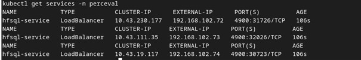

#### **Vérifier le déploiement des volumes**

```bash

kubectl get pvc -n arthur
kubectl get pvc -n leodagan
kubectl get pvc -n perceval
```

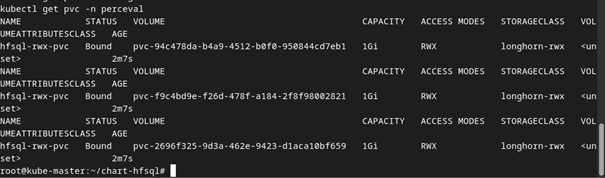

#### **Vérification dans Longhorn**

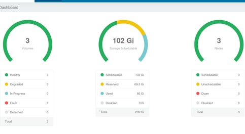
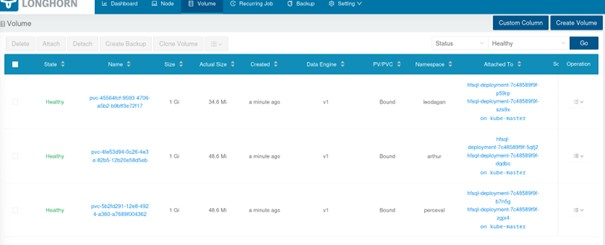
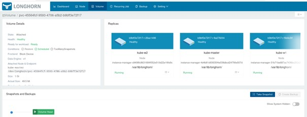


#### **Vérification de la Connexion à HFSQL via l’Adresse LoadBalancer**

-	Accessibilité Externe : Permet aux utilisateurs et aux applications clientes d’accéder aux bases de données HFSQL de manière sécurisée et fiable.
-	Validation de la Configuration : Confirme que la configuration du LoadBalancer et des services Kubernetes est correcte, garantissant ainsi une communication fluide entre les clients et les bases de données.

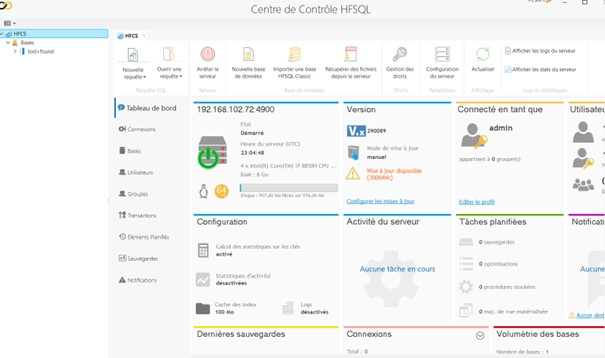

---

## **TESTS**

#### **Création d’une Base de Données dans HFSQL Control Center**

- Validation Fonctionnelle : Assure que les bases de données HFSQL peuvent être créées, configurées et utilisées correctement dans l’environnement conteneurisé.

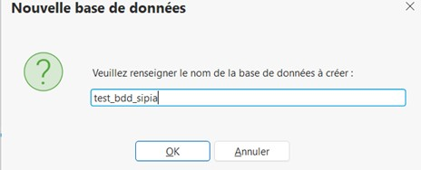

#### **Vérification dans les Pods**

-	Contrôle de l’Intégrité : Confirme que les configurations de sécurité et les permissions sur les volumes montés sont effectives, garantissant que les bases de données sont accessibles et manipulables par les applications sans erreurs.
-	Assurance de la Configuration : Permet de vérifier que les modifications apportées par les initContainers et les configurations de securityContext sont bien appliquées et fonctionnent comme prévu.

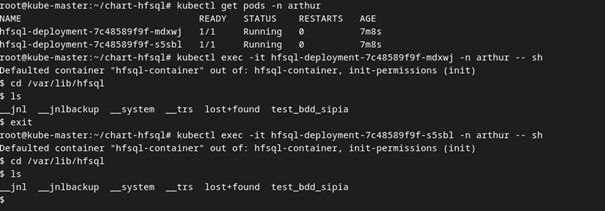

#### **Test de Résilience : Éteindre un Pod**

-	Haute Disponibilité : Assure que le cluster Kubernetes peut automatiquement redémarrer les pods HFSQL en cas de défaillance, maintenant ainsi la disponibilité continue des bases de données.
-	Résilience de l’Infrastructure : Confirme que l’infrastructure est capable de tolérer les pannes des nœuds ou des pods sans interruption de service significative.
-	Validation des Politiques de Redondance : Vérifie que les politiques de réplication et de redémarrage configurées via RKE2 et Rancher sont efficaces et fonctionnent correctement.

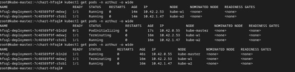

---

## **Sécurisation de l’Infrastructure**

La sécurisation de l’infrastructure est importante pour garantir l’intégrité, la disponibilité et la confidentialité des données, en particulier dans un environnement hébergé sur Kubernetes avec des solutions telles que Longhorn en RWX, MetalLB, et des applications critiques comme HFSQL et Codial. 
La démarche adoptée est globale, couvrant à la fois la couche système (serveurs) et la couche applicative (conteneurs et réseau interne du cluster). Nous avons mis en place une série de mesures allant de l’audit de sécurité, à l’analyse des malwares, en passant par le durcissement du firewall, la protection contre les brute force, la gestion des mots de passe au niveau du chargeur de démarrage, et l’isolation réseau via Network Policies.

### **Sécurisation côté serveurs**

#### **Audit Sécurité avec Lynis**

Lynis est un outil d’audit de sécurité pour systèmes Linux. Il fournit un rapport détaillé sur les points à améliorer : configurations SSH, permissions de fichiers, services inutiles.

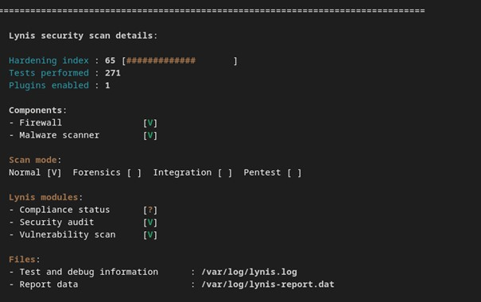
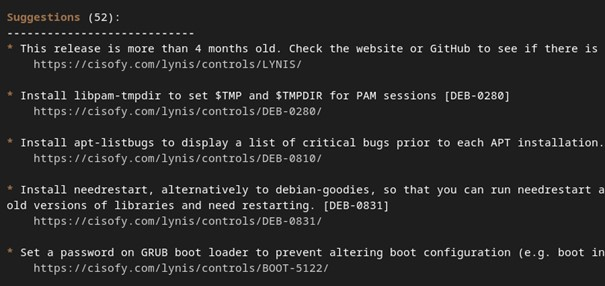

#### **Scanner de Malwares (rkhunter)**

Pour détecter la présence éventuelle de rootkits ou de malwares, j’ai installé rkhunter Ces outils scannent les répertoires système, vérifient l’intégrité de certains exécutables et recherchent des signatures connues de malwares.

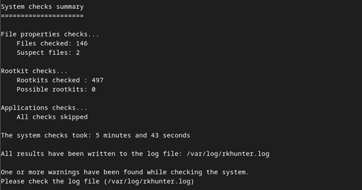

#### **Mot de passe GRUB**

Sur les serveurs physiques ou VM, en cas d’accès console, un attaquant pourrait modifier des paramètres de démarrage. J’ai configuré un mot de passe GRUB pour empêcher des modifications du kernel. 

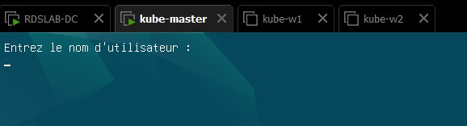

#### **Renforcement du Pare-feu avec ufw**

J’ai adopté ufw comme interface simplifiée à iptables. 
Autorisations des IP du pool de Loadbalancing
Autorisation des ports
-	HFSQL : 4900
-	Rancher : 8443
-	Longhorn : 9500 + 9501
-	Grafana : 3000
-	Prometheus : 9090
-	NeuVector : 8444
Autorisation des sous réseaux :
-	des pods 10.42.0.0/16
-	de services 10.43.0.0/16
Autorisation des ports essentiels de Kubernetes :
-	6443 API server
-	2379 etcd
-	2380 etcd

Autorisations des ports Kubelet 10250 et CNI 8285


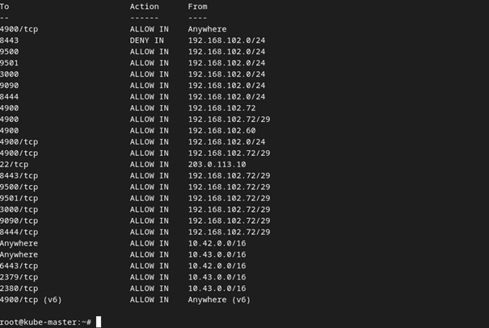


### **Sécurité Côté Conteneurs et Cluster Kubernetes**

Sur la couche Kubernetes, nous veillons à ce que les conteneurs ne tournent pas en root, que le réseau interne soit isolé, et que les flux soient strictement contrôlés.

#### **Conteneurs Non-Root**

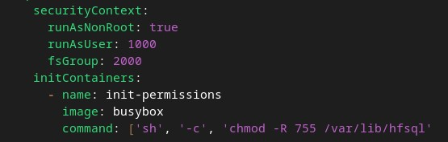

#### **Network Policies pour l’Isolation des Flux**

Avec RWX, plusieurs pods HFSQL accèdent au même volume, et plusieurs instances HFSQL dans différents namespaces cohabitent. Sans Network Policies, un autre namespace pourNous éfinissons dans le chart Helm une NetworkPolicy 

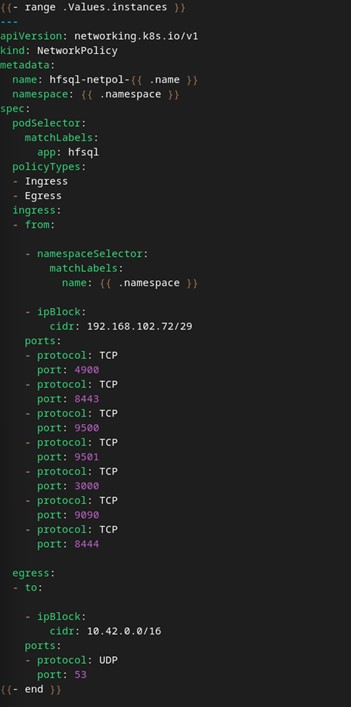

Mise à jour du Chart

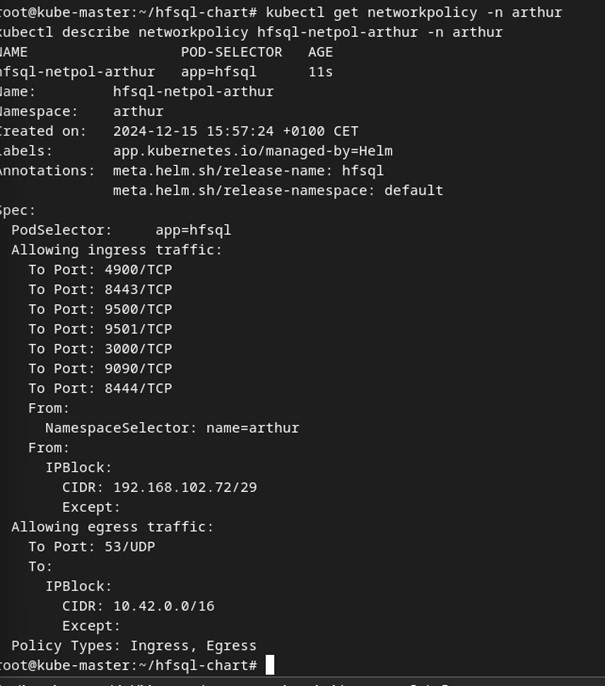

---

## **Observabilité et Sauvegardes**


#### **Zabbix côté serveur**

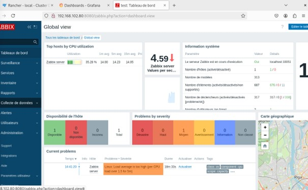

#### **Prometheus / Grafana via Neuvector**
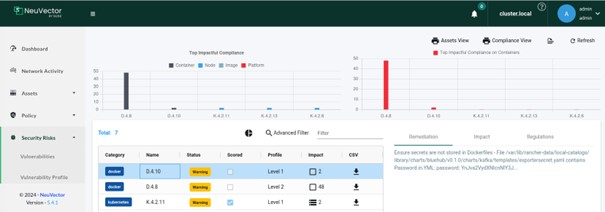


