# **Modernisation de l'Infrastructure HFSQL avec Kubernetes**

Ce projet a pour objectif de démontrer la faisabilité et les avantages de conteneuriser les bases de données HFSQL tout en assurant leur haute disponibilité, leur sécurité et leur résilience.

---

## **Objectifs du Projet**

- Trouver une solution pour isoler les instances HFSQL via des conteneurs.
- Assurer la haute disponibilité (HA) en cas de panne d’un serveur.
- Mettre en place une sauvegarde et une réplication des données.
- Sécuriser les serveurs Linux et les conteneurs.

---

## **Technologies Utilisées**

- **Kubernetes RKE2** : Distribution Kubernetes durcie pour la sécurité et la stabilité.
- **Rancher** : Gestion simplifiée et unifiée des clusters Kubernetes.
- **Longhorn** : Stockage persistant avec réplication et snapshots.
- **MetalLB** : Load Balancer open-source pour Kubernetes.
- **Helm** : Déploiement des applications HFSQL.
- **Zabbix, Prometheus & Grafana** : Monitoring de l’infrastructure.

---

## **Architecture de l'Infrastructure**


### **Zoom sur le service load balancing**


### **Zoom sur le noeud master**

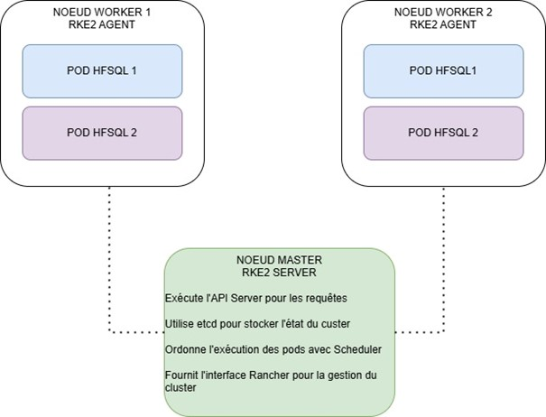

### **Zoom sur le stockage longhorn**

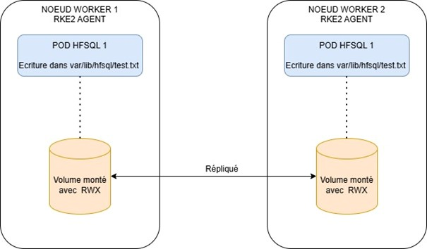


---

## **Installation de l'Infrastructure**

### **1. Préparation des Nœuds**
```bash
# Mettre à jour et installer les dépendances
apt update && apt upgrade -y
apt install -y curl gnupg lsb-release software-properties-common \
nfs-common open-iscsi iptables libnetfilter-conntrack3 conntrack \
policycoreutils cryptsetup

# Désactiver le swap
swapoff -a
sed -i '/ swap / s/^\(.*\)$/#\1/g' /etc/fstab

# Activer le routage IP
echo "net.ipv4.ip_forward=1" | sudo tee /etc/sysctl.d/99-kubernetes-cri.conf
sysctl --system
```

### **2. Installation de RKE2 sur le master**
```bash
mkdir -p /etc/rancher/rke2/
# Changer le token
cat << EOF >> /etc/rancher/rke2/config.yaml
token: rke2SecurePassword  
EOF
curl -sfL https://get.rke2.io | INSTALL_RKE2_CHANNEL=v1.29 INSTALL_RKE2_TYPE=server sh -
systemctl enable rke2-server.service && systemctl start rke2-server.service
```
### **3. Installation de Kubectl**
```bash
ln -s /var/lib/rancher/rke2/data/v1*/bin/kubectl /usr/bin/kubectl
sudo ln -s /var/run/k3s/containerd/containerd.sock /var/run/containerd/containerd.sock
cat << EOF >> ~/.bashrc
export PATH=$PATH:/var/lib/rancher/rke2/bin:/usr/local/bin/
export KUBECONFIG=/etc/rancher/rke2/rke2.yaml
export CRI_CONFIG_FILE=/var/lib/rancher/rke2/agent/etc/crictl.yaml
alias k=kubectl
EOF
source ~/.bashrc
```

### **4. Installation de RKE2 sur les Workers**
```bash
mkdir -p /etc/rancher/rke2/

# Changer l’IP du master et le token saisis auparavant
cat << EOF >> /etc/rancher/rke2/config.yaml
server: https://10.0.0.15:9345  # Adresse IP du serveur de contrôle RKE2
token: rke2SecurePassword     # Jeton d'authentification partagé
EOF

curl -sfL https://get.rke2.io | INSTALL_RKE2_CHANNEL=v1.29 INSTALL_RKE2_TYPE=agent sh –
systemctl enable rke2-agent.service && systemctl start rke2-agent.service
```
#### **Vérification que les noeuds sont bien en fonctionnement**
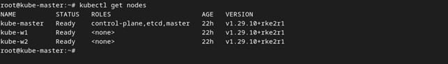

---

## **Installation de Rancher**

-	Gestion Centralisée : Permet de gérer plusieurs clusters Kubernetes depuis une seule interface, simplifiant ainsi les opérations de déploiement, de mise à jour et de surveillance.
-	Facilitation de l’Administration : Offre des fonctionnalités avancées telles que la gestion des utilisateurs, installation d’applications


```bash
mkdir -p /opt/rancher/helm
cd /opt/rancher/helm
curl -fsSL -o get_helm.sh https://raw.githubusercontent.com/helm/helm/main/scripts/get-helm-3
chmod 755 get_helm.sh && ./get_helm.sh
mv /usr/local/bin/helm /usr/bin/helm
```
#### **Installation des certificats**

```bash
helm repo add jetstack https://charts.jetstack.io
helm repo add rancher-stable https://releases.rancher.com/server-charts/stable
helm repo update

kubectl create namespace cert-manager
helm upgrade -i cert-manager jetstack/cert-manager --namespace cert-manager --set crds.enabled=true
sleep 60
```
#### **Vérification que les pods cert-manager sont en état running**

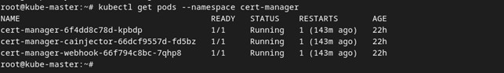

#### **Ajouter un enregistrement DNS dans la ferme RDS pour Rancher**
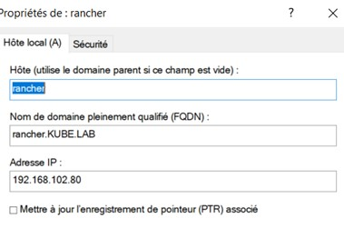

#### **Paramétrer Rancher**
```bash
kubectl create namespace cattle-system
# Changer le hostname et mdp
helm upgrade -i rancher rancher-stable/rancher \
  --namespace cattle-system \
  --set hostname=rancher.kube.lab \
  --set bootstrapPassword=RancherPa55w.rd123

sleep 45
```

#### **Vérification pods Rancher**
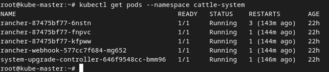

#### **Page accueil Rancher**
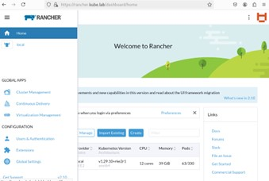
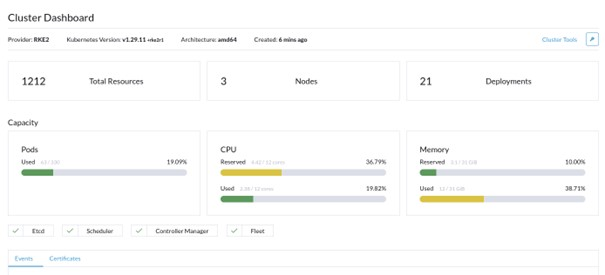


## **Installation de Longhorn pour le stockage persistant**

#### **Ajouter enregistrement DNS**
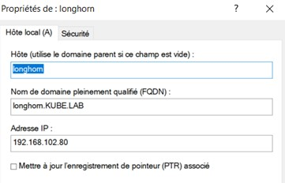

#### **Paramétrer Longhorn**
```bash
# changer le nom d’hôte
kubectl create namespace longhorn-system
helm upgrade -i longhorn longhorn/longhorn \
  --namespace longhorn-system \
  --set ingress.enabled=true \
  --set ingress.host=longhorn.kube.lab

sleep 30
```
#### **Vérification pods Longhorn**
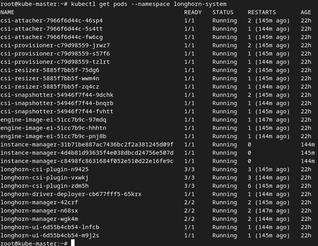
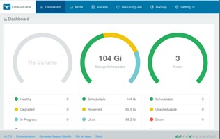

#### **Création de la classe de stockage RWX (ReadWriteMany) fichier longhorn-rwx-storageclass.yaml**

```yaml
apiVersion: storage.k8s.io/v1
kind: StorageClass
metadata:
  name: longhorn-rwx  # Nom de la StorageClass
provisioner: driver.longhorn.io
parameters:
  allowVolumeExpansion: "true"
reclaimPolicy: Delete
volumeBindingMode: Immediate
```
#### **Application du fichier**

```bash
kubectl apply -f longhorn-rwx-storageclass.yaml
```
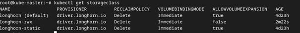


---


## **Installation de MetalLB pour le loadbalancing**

```bash
helm repo add metallb https://metallb.github.io/metallb
helm repo update
kubectl create namespace metallb-system
helm install metallb metallb/metallb --namespace metallb-system --version 0.14.8
```
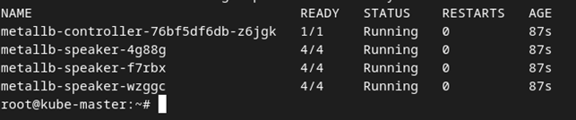

#### **Configuration de metallb fichier metallb-config.yaml**

```yaml
apiVersion: metallb.io/v1beta1
kind: IPAddressPool
metadata:
  name: my-ip-pool
  namespace: metallb-system
spec:
  addresses:
  - 192.168.102.71-192.168.101.79  # Remplacez par une plage IP disponible dans le réseau
---
apiVersion: metallb.io/v1beta1
kind: L2Advertisement
metadata:
  name: my-l2-advertisement
  namespace: metallb-system
spec:
  ipAddressPools:
  - my-ip-pool
```

#### **Application du fichier et vérification**

```bash
kubectl apply -f metallb-config.yaml

kubectl get ipaddresspool -n metallb-system
kubectl get l2advertisement -n metallb-system
```
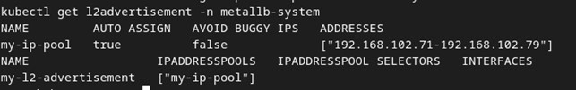

---

## **Création du Chart Helm pour le déploiement des instances HFSQL**

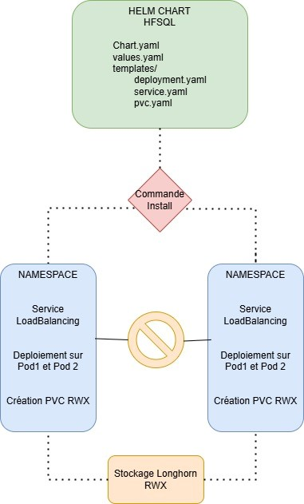


#### **Création des namespaces des instances**
```bash
kubectl create namespace instance1
kubectl create namespace instance2
kubectl create namespace instance3
```

#### **structure du Chart**
- Chart.yaml
- values.yaml
- templates/
  - deployment.yaml
  - service.yaml
  - pvc.yaml
 
#### **fichier Chart.yaml**
```yaml
apiVersion: v2
name: hfsql
description: Helm chart HFSQL
type: application
version: 1.0.0
appVersion: "290089"  # Version de l'image Docker HFSQL
```
#### **fichier values.yaml**
```yaml
instances:
  - name: instance1
    namespace: instance1
    loadBalancerIP: 192.168.102.72
    password: "Pa55w.rd123"  
    storageSize: 1Gi          
    replicas: 2               
  - name: instance2
    namespace: instance2
    loadBalancerIP: 192.168.102.73
    password: "Pa55w.rd123"
    storageSize: 1Gi
    replicas: 2
  - name: instance3
    namespace: instance3
    loadBalancerIP: 192.168.102.74
    password: "Pa55w.rd123"
    storageSize: 1Gi
    replicas: 2

storageClassName: longhorn-rwx

```
#### **fichier deployment.yaml**
```yaml
{{- range .Values.instances }}
---
apiVersion: apps/v1
kind: Deployment
metadata:
  name: hfsql-deployment
  namespace: {{ .namespace }}
  labels:
    app: hfsql
spec:
  replicas: {{ .replicas }}
  selector:
    matchLabels:
      app: hfsql
  template:
    metadata:
      labels:
        app: hfsql
    spec:
      initContainers:
        - name: init-permissions
          image: busybox
          command: ['sh', '-c', 'chmod -R 777 /var/lib/hfsql']
          volumeMounts:
            - name: hfsql-data
              mountPath: /var/lib/hfsql
      containers:
        - name: hfsql-container
          image: windev/hfsql:{{ $.Chart.AppVersion }}
          ports:
            - containerPort: 4900
          env:
            - name: HFSQL_PASSWORD
              value: "{{ .password }}"  # Définition directe du mot de passe
          volumeMounts:
            - name: hfsql-data
              mountPath: /var/lib/hfsql
      volumes:
        - name: hfsql-data
          persistentVolumeClaim:
            claimName: hfsql-rwx-pvc
{{- end }

```
#### **fichier service.yaml**
```yaml
{{- range .Values.instances }}
---
apiVersion: v1
kind: Service
metadata:
  name: hfsql-service
  namespace: {{ .namespace }}
spec:
  selector:
    app: hfsql
  ports:
    - name: hfsql-port
      protocol: TCP
      port: 4900
      targetPort: 4900
  type: LoadBalancer
  loadBalancerIP: {{ .loadBalancerIP }}
{{- end }}

```
#### **fichier pvc.yaml**
```yaml
{{- range .Values.instances }}
---
apiVersion: v1
kind: PersistentVolumeClaim
metadata:
  name: hfsql-rwx-pvc
  namespace: {{ .namespace }}
spec:
  storageClassName: {{ $.Values.storageClassName }}
  accessModes:
    - ReadWriteMany
  resources:
    requests:
      storage: {{ .storageSize }}
{{- end }}

```

#### **déploiement du Chart**

```bash
helm lint .
helm install hfsql . --namespace default

```
#### **Vérifier le déploiement, les services et les pvc**
```bash
kubectl get pods -n instance1 -o wide
kubectl get pods -n instance2 -o wide
kubectl get pods -n instance3 -o wide

kubectl get services -n instance1
kubectl get services -n instance2
kubectl get services -n instance3

kubectl get pvc -n instance1
kubectl get pvc -n instance2
kubectl get pvc -n instance3

```


