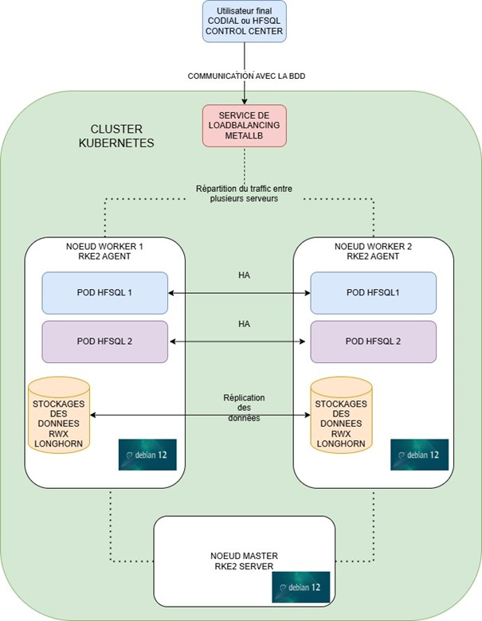

# **Modernisation de l'Infrastructure HFSQL avec Kubernetes**

Ce projet a pour objectif de démontrer la faisabilité et les avantages de conteneuriser les bases de données HFSQL tout en assurant leur haute disponibilité, leur sécurité et leur résilience.

---

## **Objectifs du Projet**

- Trouver une solution pour isoler les instances HFSQL via des conteneurs.
- Assurer la haute disponibilité (HA) en cas de panne d’un serveur.
- Mettre en place une sauvegarde et une réplication des données.
- Sécuriser les serveurs Linux et les conteneurs.

---

## **Technologies Utilisées**

- **Kubernetes RKE2** : Distribution Kubernetes durcie pour la sécurité et la stabilité.
- **Rancher** : Gestion simplifiée et unifiée des clusters Kubernetes.
- **Longhorn** : Stockage persistant avec réplication et snapshots.
- **MetalLB** : Load Balancer open-source pour Kubernetes.
- **Helm** : Déploiement des applications HFSQL.
- **Zabbix, Prometheus & Grafana** : Monitoring de l’infrastructure.

---

## **Architecture de l'Infrastructure**



### **Zoom sur le service load balancing**


### **Zoom sur le noeud master**


### **Zoom sur le stockage longhorn**


---

## **Installation de l'Infrastructure**

### **1. Préparation des Nœuds**
```bash
# Mettre à jour et installer les dépendances
apt update && apt upgrade -y
apt install -y curl gnupg lsb-release software-properties-common \
nfs-common open-iscsi iptables libnetfilter-conntrack3 conntrack \
policycoreutils cryptsetup

# Désactiver le swap
swapoff -a
sed -i '/ swap / s/^\(.*\)$/#\1/g' /etc/fstab

# Activer le routage IP
echo "net.ipv4.ip_forward=1" | sudo tee /etc/sysctl.d/99-kubernetes-cri.conf
sysctl --system
